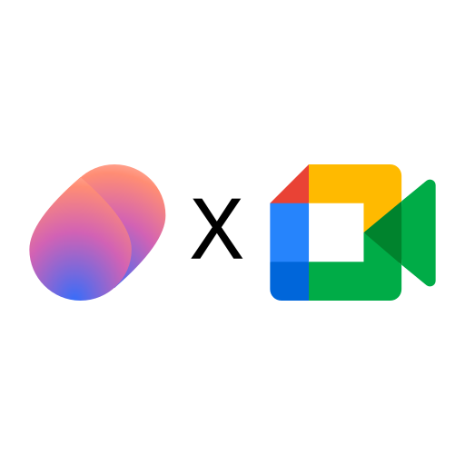
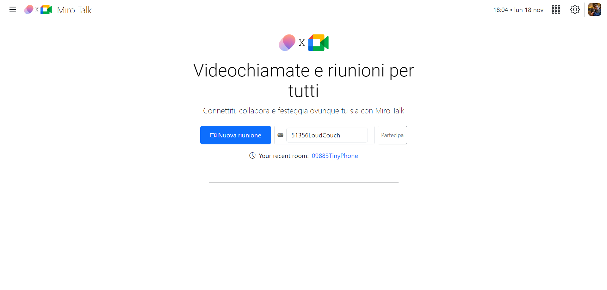
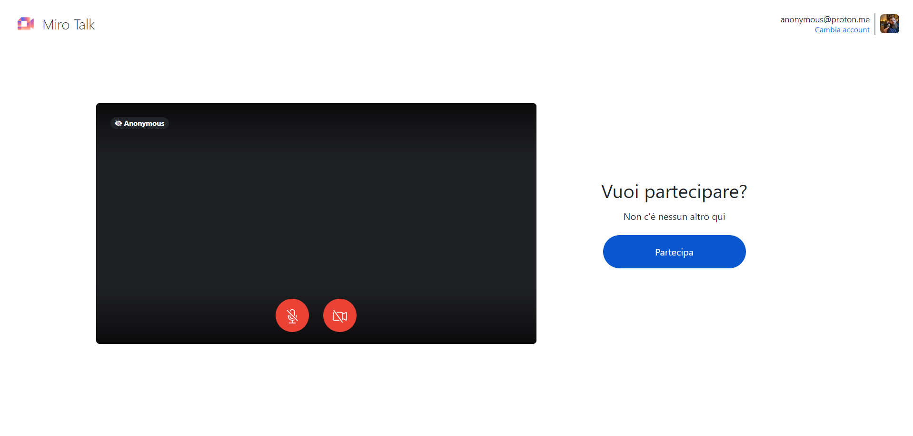

<h1 align="center">MiroTalk P2P - Meet Themed</h1>

<div align="center">
    
    <p> Mirotalk collab GMeet </p> 

</div>

<p align="center">Free WebRTC - P2P - Simple, Secure, Fast Real-Time Video Conferences with support for up to 8k resolution and 60fps. It's compatible with all major browsers and platforms.</p>

<hr />

Nota1: Il tema è stato realizzato con BootstrapCSS v5.3 (è veloce per creare template al volo)

Nota2: I file modificati per ora sono:

- [Landing.html](./public/views/new_landing.html)
- [PreJoin.html](./public/views/preJoin.html)

<hr />

<p align="center">
    <a href="https://p2p.mirotalk.com"></a>
</p>

<p align="center">
    <a href="https://p2p.mirotalk.com"></a>
</p>


<hr />

<p align="center">
    <a href="https://p2p.mirotalk.com"></a>
</p>

<hr />


<details>
<summary>Features</summary>

<br/>

-   Is `100% Free` - `Open Source under (AGPLv3)` - `Self Hosted` and [PWA](https://en.wikipedia.org/wiki/Progressive_web_application)!
-   No downloads, plugins, or logins required – completely browser-based.
-   Unlimited conference rooms with no time limitations.
-   Translated into 133 languages.
-   Support for the OpenID Connect (OIDC) authentication layer.
-   Host protection to prevent unauthorized access.
-   User auth to prevent unauthorized access.
-   Room password protection.
-   JWT.io securely manages credentials for host configurations and user authentication, enhancing security and streamlining processes.
-   Compatible with desktop and mobile devices.
-   Optimized mobile room URL sharing.
-   Webcam streaming with front and rear camera support for mobile devices.
-   Crystal-clear audio streaming with speaking detection and volume indicators.
-   Screen sharing for presentations.
-   File sharing with drag-and-drop support.
-   Choose your audio input, output, and video source.
-   Supports video quality up to 8K and 60 FPS.
-   Supports advance Picture-in-Picture (PiP) offering a more streamlined and flexible viewing experience.
-   Record your screen, audio, and video.
-   Snapshot video frames and save them as PNG images.
-   Chat with an Emoji Picker for expressing feelings, private messages, Markdown support, and conversation saving.
-   ChatGPT (powered by OpenAI) for answering questions, providing information, and connecting users to relevant resources.
-   Speech recognition for sending spoken messages.
-   Push-to-talk functionality, similar to a walkie-talkie.
-   Advanced collaborative whiteboard for teachers.
-   Real-time sharing of YouTube embed videos, video files (MP4, WebM, OGG), and audio files (MP3).
-   Full-screen mode with one-click video element zooming and pin/unpin.
-   Customizable UI themes.
-   Right-click options on video elements for additional controls.
-   Direct peer-to-peer connections for low-latency communication through WebRTC.
-   Supports [REST API](app/api/README.md) (Application Programming Interface).
-   Integration with [Mattermost](https://mattermost.com/) for enhanced communication.
-   Integration with [Slack](https://api.slack.com/apps/) for enhanced communication.
-   Utilizes [Sentry](https://sentry.io/) for error reporting.
-   And much more...

</details>


</details>

<details>
<summary>Start videoconference</summary>

<br/>

1. `Open` [MiroTalk P2P](https://p2p.mirotalk.com/newcall) or [alternative link](https://mirotalk.up.railway.app/newcall).
2. `Choose` a room name and click **Join Room**.
3. `Grant` camera and microphone access.
4. `Share` the room URL and wait for participants to join the video conference.

</details>

<details>
<summary>Direct Join</summary>

<br/>

-   You can `directly join a room` by using links like:
-   https://p2p.mirotalk.com/join?room=test&name=mirotalk&audio=0&video=0&screen=0&hide=0&notify=0
-   https://mirotalk.up.railway.app/join?room=test&name=mirotalk&audio=0&video=0&screen=0&hide=0&notify=0

    | Params | Type    | Description     |
    | ------ | ------- | --------------- |
    | room   | string  | Room Id         |
    | name   | string  | User name       |
    | audio  | boolean | Audio stream    |
    | video  | boolean | Video stream    |
    | screen | boolean | Screen stream   |
    | hide   | boolean | Hide myself     |
    | notify | boolean | Welcome message |
    | token  | string  | jwt token       |

> **Note**
>
> The `token` parameter are optional when either `HOST_PROTECTED` or `HOST_USER_AUTH` is set to `true` in the `.env` file. The valid list of users is defined in the `HOST_USERS` configuration.

</details>

<details>
<summary>Host Protection Configuration</summary>

<br/>

When [host protection](https://docs.mirotalk.com/mirotalk-p2p/host-protection/) or host user auth is enabled, the host/users must provide a valid username and password as specified in the `.env` file.

| Params           | Value                                                                            | Description                                                                            |
| ---------------- | -------------------------------------------------------------------------------- | -------------------------------------------------------------------------------------- |
| `HOST_PROTECTED` | `true` if protection is enabled, `false` if not (default false)                  | Requires the host to provide a valid username and password during room initialization. |
| `HOST_USER_AUTH` | `true` if user authentication is required, `false` if not (default false).       | Determines whether host authentication is required.                                    |
| `HOST_USERS`     | JSON array with user objects: `{"username": "username", "password": "password"}` | List of valid host users with their credentials.                                       |

</details>

</details>

<details open>
<summary>Embed a meeting</summary>

<br/>

To embed a meeting within `your service or app` using an iframe, you can use the following code:

```html
<iframe
    allow="camera; microphone; display-capture; fullscreen; clipboard-read; clipboard-write; web-share; autoplay"
    src="https://p2p.mirotalk.com/newcall"
    style="height: 100vh; width: 100vw; border: 0px;"
></iframe>
```

</details>

<details open>
<summary>Quick start</summary>

<br/>

-   Before running MiroTalk P2P, ensure you have `Node.js` installed. This project has been tested with Node versions [12.X](https://nodejs.org/en/blog/release/v12.22.1/), [14.X](https://nodejs.org/en/blog/release/v14.17.5/), [16.X](https://nodejs.org/en/blog/release/v16.15.1/) and [18.x](https://nodejs.org/en/download).

```bash
# clone this repo
$ git clone https://github.com/miroslavpejic85/mirotalk.git
# go to mirotalk dir
$ cd mirotalk
# copy .env.template to .env (edit it according to your needs)
$ cp .env.template .env
# install dependencies
$ npm install
# start the server
$ npm start
```

-   Open [http://localhost:3000](http://localhost:3000) in your browser.

</details>


<details>
<summary>Documentations</summary>

<br>

-   `Ngrok/HTTPS:` You can start a video conference directly from your local PC and make it accessible from any device outside your network by following [these instructions](docs/ngrok.md), or expose it directly on [HTTPS](app/ssl/README.md).

-   `Stun/Turn:` Install your own [Stun & Turn](https://docs.mirotalk.com/coturn/stun-turn/) by following [this instructions](./docs/coturn.md).

-   `Self-hosting:` For `self-hosting MiroTalk P2P` on your own dedicated server, please refer to [this comprehensive guide](docs/self-hosting.md). It will provide you with all the necessary instructions to get your MiroTalk P2P instance up and running smoothly.

-   `Rest API:` The [API documentation](https://docs.mirotalk.com/mirotalk-p2p/api/) uses [swagger](https://swagger.io/) at http://localhost:3000/api/v1/docs. Or check it out on [live](https://p2p.mirotalk.com/api/v1/docs).

```bash
# The response will give you the active meetings (default disabled).
$ curl -X GET "http://localhost:3000/api/v1/meetings" -H "authorization: mirotalksfu_default_secret" -H "Content-Type: application/json"
$ curl -X GET "https://p2p.mirotalk.com/api/v1/meetings" -H "authorization: mirotalksfu_default_secret" -H "Content-Type: application/json"
$ curl -X GET "mirotalk.up.railway.app/api/v1/meetings" -H "authorization: mirotalksfu_default_secret" -H "Content-Type: application/json"
# The response will give you a entrypoint / Room URL for your meeting.
$ curl -X POST "http://localhost:3000/api/v1/meeting" -H "authorization: mirotalkp2p_default_secret" -H "Content-Type: application/json"
$ curl -X POST "https://p2p.mirotalk.com/api/v1/meeting" -H "authorization: mirotalkp2p_default_secret" -H "Content-Type: application/json"
$ curl -X POST "https://mirotalk.up.railway.app/api/v1/meeting" -H "authorization: mirotalkp2p_default_secret" -H "Content-Type: application/json"
# The response will give you a entrypoint / URL for the direct join to the meeting.
$ curl -X POST "http://localhost:3000/api/v1/join" -H "authorization: mirotalkp2p_default_secret" -H "Content-Type: application/json" --data '{"room":"test","name":"mirotalk","audio":"true","video":"true","screen":"false","hide":"false","notify":"true"}'
$ curl -X POST "https://p2p.mirotalk.com/api/v1/join" -H "authorization: mirotalkp2p_default_secret" -H "Content-Type: application/json" --data '{"room":"test","name":"mirotalk","audio":"true","video":"true","screen":"false","hide":"false","notify":"true"}'
$ curl -X POST "https://mirotalk.up.railway.app/api/v1/join" -H "authorization: mirotalkp2p_default_secret" -H "Content-Type: application/json" --data '{"room":"test","name":"mirotalk","audio":"true","video":"true","screen":"false","hide":"false","notify":"true"}'
# The response will give you an entry point/URL for direct joining to the meeting with a token.
$ curl -X POST "http://localhost:3000/api/v1/join" -H "authorization: mirotalkp2p_default_secret" -H "Content-Type: application/json" --data '{"room":"test","name":"mirotalk","audio":"true","video":"true","screen":"false","hide":"false","notify":"true","token":{"username":"username","password":"password","presenter":"true", "expire":"1h"}}'
$ curl -X POST "https://p2p.mirotalk.com/api/v1/join" -H "authorization: mirotalkp2p_default_secret" -H "Content-Type: application/json" --data '{"room":"test","name":"mirotalk","audio":"true","video":"true","screen":"false","hide":"false","notify":"true","token":{"username":"username","password":"password","presenter":"true", "expire":"1h"}}'
$ curl -X POST "https://mirotalk.up.railway.app/api/v1/join" -H "authorization: mirotalkp2p_default_secret" -H "Content-Type: application/json" --data '{"room":"test","name":"mirotalk","audio":"true","video":"true","screen":"false","hide":"false","notify":"true","token":{"username":"username","password":"password","presenter":"true", "expire":"1h"}}'
# The response will give you a valid token for a meeting.
$ curl -X POST "http://localhost:3000/api/v1/token" -H "authorization: mirotalkp2p_default_secret" -H "Content-Type: application/json" --data '{"username":"username","password":"password","presenter":"true", "expire":"1h"}'
$ curl -X POST "https://p2p.mirotalk.com/api/v1/token" -H "authorization: mirotalkp2p_default_secret" -H "Content-Type: application/json" --data '{"username":"username","password":"password","presenter":"true", "expire":"1h"}'
$ curl -X POST "https://mirotalk.up.railway.app/api/v1/join" -H "authorization: mirotalkp2p_default_secret" -H "Content-Type: application/json" --data '{"username":"username","password":"password","presenter":"true", "expire":"1h"}'
```

</details>

<details>
<summary>Security</summary>

<br/>

For `Security` concerning, please follow [this documentation](./SECURITY.md).

</details>

<details>
<summary>Credits</summary>

<br/>

-   ianramzy (html)
-   vasanthv (webrtc-logic)
-   fabric.js (whiteboard)

</details>

